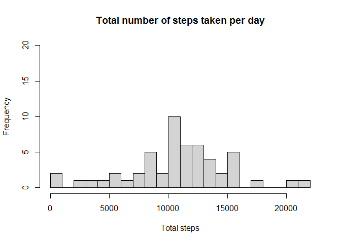
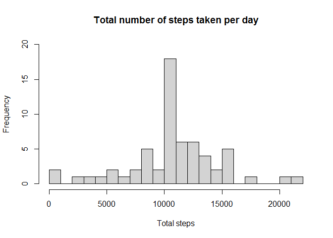
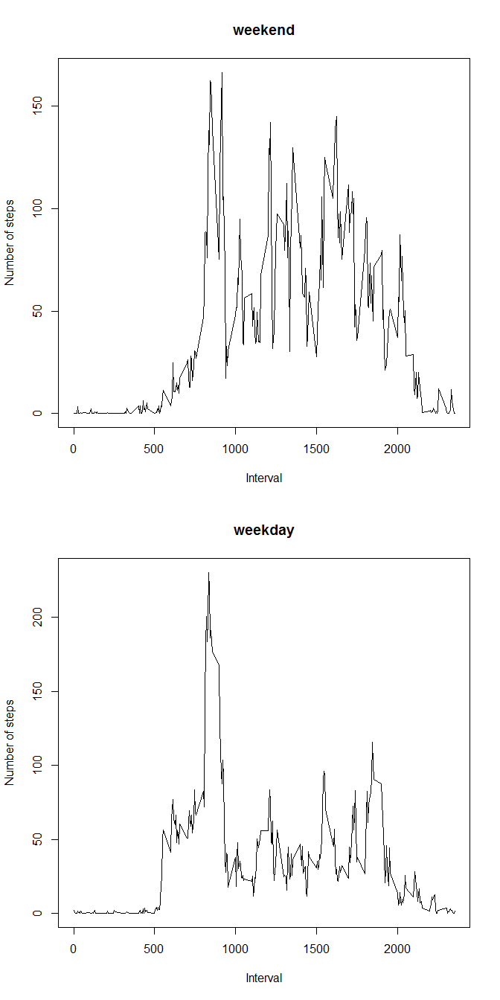

## Loading and preprocessing the data

```r
dataset <- read.csv("activity.csv", sep=",")
dataset_without_na <- dataset[complete.cases(dataset),]
```

Let's see 'summary' and 'head' for dataset with and without NAs

See the 'summary' of dataset has 2304 NAs but 'summary' of dataset_without_NA doesn't have any NAs

```r
summary(dataset)
```

```
##      steps            date              interval     
##  Min.   :  0.00   Length:17568       Min.   :   0.0  
##  1st Qu.:  0.00   Class :character   1st Qu.: 588.8  
##  Median :  0.00   Mode  :character   Median :1177.5  
##  Mean   : 37.38                      Mean   :1177.5  
##  3rd Qu.: 12.00                      3rd Qu.:1766.2  
##  Max.   :806.00                      Max.   :2355.0  
##  NA's   :2304
```

```r
summary(dataset_without_na)
```

```
##      steps            date              interval     
##  Min.   :  0.00   Length:15264       Min.   :   0.0  
##  1st Qu.:  0.00   Class :character   1st Qu.: 588.8  
##  Median :  0.00   Mode  :character   Median :1177.5  
##  Mean   : 37.38                      Mean   :1177.5  
##  3rd Qu.: 12.00                      3rd Qu.:1766.2  
##  Max.   :806.00                      Max.   :2355.0
```

```r
head(dataset)
```

```
##   steps       date interval
## 1    NA 2012-10-01        0
## 2    NA 2012-10-01        5
## 3    NA 2012-10-01       10
## 4    NA 2012-10-01       15
## 5    NA 2012-10-01       20
## 6    NA 2012-10-01       25
```

```r
head(dataset_without_na)
```

```
##     steps       date interval
## 289     0 2012-10-02        0
## 290     0 2012-10-02        5
## 291     0 2012-10-02       10
## 292     0 2012-10-02       15
## 293     0 2012-10-02       20
## 294     0 2012-10-02       25
```


## What is mean total number of steps taken per day?
Below code is used to calculate total number of steps taken per day

```r
total_steps_per_day <- tapply(dataset$steps,dataset$date,sum)
head(total_steps_per_day)
```

```
## 2012-10-01 2012-10-02 2012-10-03 2012-10-04 2012-10-05 2012-10-06 
##         NA        126      11352      12116      13294      15420
```

```r
hist(total_steps_per_day,25,ylim=c(0,20), main="Total number of steps taken per day", xlab="Total steps")
```

<!-- -->

Below code is used to calculate mean and median of total number of steps taken per day

```r
mean_steps_per_day <- tapply(dataset$steps,dataset$date,mean)
head(mean_steps_per_day)
```

```
## 2012-10-01 2012-10-02 2012-10-03 2012-10-04 2012-10-05 2012-10-06 
##         NA    0.43750   39.41667   42.06944   46.15972   53.54167
```

```r
median_steps_per_day <- tapply(dataset$steps,dataset$date,median)
head(median_steps_per_day)
```

```
## 2012-10-01 2012-10-02 2012-10-03 2012-10-04 2012-10-05 2012-10-06 
##         NA          0          0          0          0          0
```


## What is the average daily activity pattern?
Code for plotting time series plot

```r
mean_steps_per_interval <- tapply(dataset_without_na$steps,dataset_without_na$interval,mean)
head(mean_steps_per_interval)
```

```
##         0         5        10        15        20        25 
## 1.7169811 0.3396226 0.1320755 0.1509434 0.0754717 2.0943396
```

```r
m <- cbind(mean_steps_per_interval,dataset[1:288,3])
colnames(m) <- c("Mean.steps","Interval")
head(m)
```

```
##    Mean.steps Interval
## 0   1.7169811        0
## 5   0.3396226        5
## 10  0.1320755       10
## 15  0.1509434       15
## 20  0.0754717       20
## 25  2.0943396       25
```

```r
plot(m[,2],m[,1], type="l", xlab="Interval", ylab="Average number of steps taken")
```

<!-- -->

Code for finding interval that contains maximum number of steps

```r
max_steps <- max(mean_steps_per_interval)
max_steps
```

```
## [1] 206.1698
```

```r
index_of_max_steps <- which(mean_steps_per_interval==max_steps)
interval_of_max_steps <- dataset_without_na[index_of_max_steps,3]
interval_of_max_steps
```

```
## [1] 835
```
Interval having maximum number of steps is **835** which contains *206.1698113* steps


## Imputing missing values
Below code calculates total number of missing values

```r
number_of_rows_with_NA <- sum(is.na(dataset))  
number_of_rows_with_NA
```

```
## [1] 2304
```
Total number of missing values are **2304**

Strategy --> Mean steps per 5-minute interval is used to replace NAs

```r
round_off <- round(mean_steps_per_interval)  
v <- cbind(round_off,dataset[1:length(round_off),3])
colnames(v) <- c("Mean.steps","Interval")
head(v)
```

```
##    Mean.steps Interval
## 0           2        0
## 5           0        5
## 10          0       10
## 15          0       15
## 20          0       20
## 25          2       25
```

```r
new_dataset <- dataset
for(i in 1:dim(v)[1]){
        for(j in 1:dim(new_dataset)[1]){
                if(is.na(new_dataset[j,1]) && new_dataset[j,3]==v[i,2]){
                        new_dataset[j,1] <- v[i,1]
                }
        }
}
```

New dataset with replaced NAs is shown below

```r
head(new_dataset)
```

```
##   steps       date interval
## 1     2 2012-10-01        0
## 2     0 2012-10-01        5
## 3     0 2012-10-01       10
## 4     0 2012-10-01       15
## 5     0 2012-10-01       20
## 6     2 2012-10-01       25
```

Below code is used to calculate total number of steps taken per day for new dataset

```r
new_total_steps_per_day <- tapply(new_dataset$steps,new_dataset$date,sum)
head(new_total_steps_per_day)
```

```
## 2012-10-01 2012-10-02 2012-10-03 2012-10-04 2012-10-05 2012-10-06 
##      10762        126      11352      12116      13294      15420
```

```r
hist(new_total_steps_per_day,25,ylim=c(0,20), main="Total number of steps taken per day", xlab="Total steps")
```

<!-- -->

Below code is used to calculate mean and median of total number of steps taken per day for new dataset

```r
new_mean_steps_per_day <- tapply(new_dataset$steps,new_dataset$date,mean)
head(new_mean_steps_per_day)
```

```
## 2012-10-01 2012-10-02 2012-10-03 2012-10-04 2012-10-05 2012-10-06 
##   37.36806    0.43750   39.41667   42.06944   46.15972   53.54167
```

```r
new_median_steps_per_day <- tapply(new_dataset$steps,new_dataset$date,median)
head(new_median_steps_per_day)
```

```
## 2012-10-01 2012-10-02 2012-10-03 2012-10-04 2012-10-05 2012-10-06 
##       34.5        0.0        0.0        0.0        0.0        0.0
```

Below code shows impact of imputing missing values on total steps

```r
total_steps <- sum(dataset_without_na[,1])
total_steps
```

```
## [1] 570608
```

```r
new_total_steps <- sum(new_total_steps_per_day)
new_total_steps
```

```
## [1] 656704
```

```r
total_steps_diff <- new_total_steps - total_steps
total_steps_diff
```

```
## [1] 86096
```
'Total steps' difference for old and new dataset is **8.6096\times 10^{4}**


## Are there differences in activity patterns between weekdays and weekends?
Code to convert date data in our dataset to 'Date' class

```r
new_dataset$date <- as.Date(new_dataset$date)
```

Below code creates new column indicating day type

```r
new_dataset$day.type <- weekdays(new_dataset$date, abbreviate=FALSE)
head(new_dataset)
```

```
##   steps       date interval day.type
## 1     2 2012-10-01        0   Monday
## 2     0 2012-10-01        5   Monday
## 3     0 2012-10-01       10   Monday
## 4     0 2012-10-01       15   Monday
## 5     0 2012-10-01       20   Monday
## 6     2 2012-10-01       25   Monday
```

Below code converts day type to either weekday or weekend

```r
for(i in 1:dim(new_dataset)[1]){                                      
        if(new_dataset[i,4]=="Saturday" | new_dataset[i,4]=="Sunday"){
                new_dataset[i,4] <- "weekend"
        }
        else{new_dataset[i,4] <- "weekday"}
}
head(new_dataset)
```

```
##   steps       date interval day.type
## 1     2 2012-10-01        0  weekday
## 2     0 2012-10-01        5  weekday
## 3     0 2012-10-01       10  weekday
## 4     0 2012-10-01       15  weekday
## 5     0 2012-10-01       20  weekday
## 6     2 2012-10-01       25  weekday
```

Code for plotting time series plot

```r
new_mean_steps_per_interval <- with(new_dataset, tapply(steps, list(interval,day.type),mean))
head(new_mean_steps_per_interval)
```

```
##       weekday weekend
## 0  2.28888889    0.25
## 5  0.40000000    0.00
## 10 0.15555556    0.00
## 15 0.17777778    0.00
## 20 0.08888889    0.00
## 25 1.57777778    3.50
```

```r
k <- cbind(new_dataset[1:length(round_off),3], new_mean_steps_per_interval)
colnames(k) <- c("Interval","weekday.mean.steps","weekend.mean.steps")
head(k)
```

```
##    Interval weekday.mean.steps weekend.mean.steps
## 0         0         2.28888889               0.25
## 5         5         0.40000000               0.00
## 10       10         0.15555556               0.00
## 15       15         0.17777778               0.00
## 20       20         0.08888889               0.00
## 25       25         1.57777778               3.50
```

```r
par(mfrow=c(2,1))
plot(k[,1], k[,3], type="l", xlab="Interval", ylab="Number of steps", main="weekend")
plot(k[,1], k[,2], type="l", xlab="Interval", ylab="Number of steps", main="weekday")
```

<!-- -->
